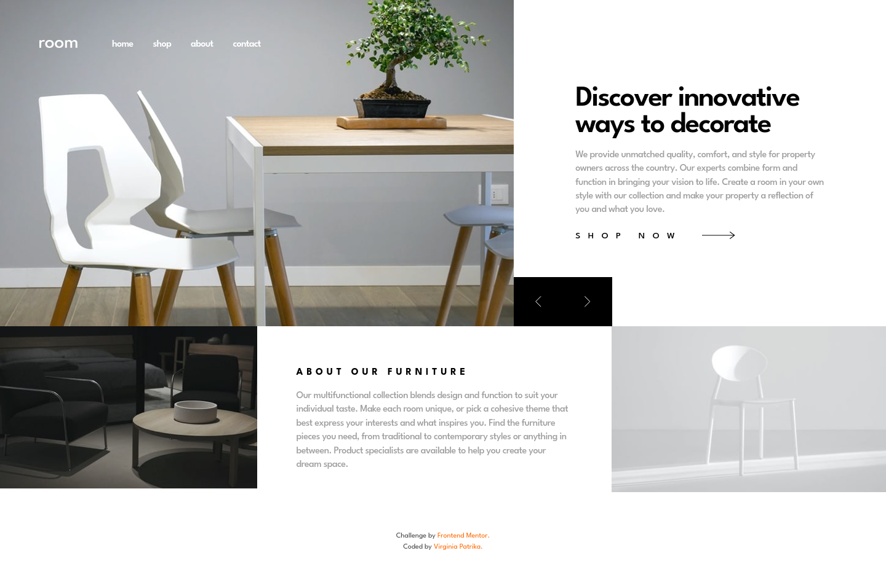

# Frontend Mentor - Room homepage solution

This is a solution to the [Room homepage challenge on Frontend Mentor](https://www.frontendmentor.io/challenges/room-homepage-BtdBY_ENq). Frontend Mentor challenges help you improve your coding skills by building realistic projects.

## Table of contents

- [Overview](#overview)
  - [The challenge](#the-challenge)
  - [Screenshot](#screenshot)
  - [Links](#links)
- [My process](#my-process)
  - [Built with](#built-with)
  - [What I learned](#what-i-learned)
  - [Continued development](#continued-development)
  - [AI Collaboration](#ai-collaboration)
- [Author](#author)

## Overview

### The challenge

Users should be able to:

- View the optimal layout for the site depending on their device's screen size
- See hover states for all interactive elements on the page
- Navigate the slider using either their mouse/trackpad or keyboard

### Screenshot

### Links

- Solution URL: [Github](https://github.com/VirginiaPat/room-homepage.git)
- Live Site URL: [Netlify](https://room-homepage-virgi.netlify.app/)

## My process

### Built with

- Semantic HTML5 markup, following the [ARIA Authoring Practices carousel pattern](https://www.w3.org/WAI/ARIA/apg/patterns/carousel/)
- Native `<dialog>` element for the accessible mobile navigation menu
- Tailwind CSS v4 with custom `@theme` design tokens and `@utility` typography presets
- Vanilla JavaScript (ES Modules), organized into feature-scoped modules
- CSS Grid & Flexbox
- Mobile-first workflow

### What I learned

Building the hero carousel taught me how much thought goes into making an interactive component genuinely accessible, not just visually functional. I followed the [ARIA Authoring Practices carousel pattern](https://www.w3.org/WAI/ARIA/apg/patterns/carousel/), using `role="group"`, `aria-roledescription="slide"`, and `aria-describedby` to semantically link each slide's image to its text content, even though the two live in separate parts of the DOM. On the CSS side, debugging an inconsistent crossfade taught me how `:not()` pseudo-classes affect specificity, and switching from `:focus` to `:focus-visible` throughout the project made me think more carefully about the difference between mouse and keyboard interaction. Finally, writing a small `validateDom` helper to check for missing elements before attaching event listeners — and fixing a null-reference bug it didn't originally catch — reinforced how valuable defensive coding is once JavaScript starts touching the DOM directly.

### Continued development

The carousel's autoplay currently pauses on hover and keyboard focus, but it has no explicit play/pause control, which I'd like to add to better meet WCAG 2.2.2 (Pause, Stop, Hide). Longer term, I'd like to get more comfortable writing animations from scratch instead of leaning on Tailwind's animation utilities for everything, since that was one of my main goals with this challenge.

### AI Collaboration

I used Claude as a mentor throughout this project, in a guided-discovery mode rather than having it write code for me. For most features — the accessible hamburger dialog, the carousel's ARIA structure, the crossfade animation logic — I'd share my in-progress code and get targeted questions back instead of fixes: things like "what happens to this event listener if `prefers-reduced-motion` is on?" or "what's the specificity difference between these two selectors?" That approach consistently led me to find and fix my own bugs — including a `null.children` crash and a dangling `aria-describedby` reference — rather than just receiving a patched version. What worked especially well was asking it to hold off on code and just explain a concept first (like `:focus` vs `:focus-visible`, or why `<dialog>` handles focus trapping natively) before I touched the implementation myself.

## Author

- Frontend Mentor - [@VirginiaPat](https://www.frontendmentor.io/profile/VirginiaPat)
- GitHub - [VirginiaPat ](https://github.com/VirginiaPat)
- Netlify - [VirginiaPat](https://app.netlify.com/teams/virginia-patrika/sites)
